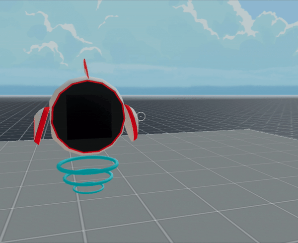
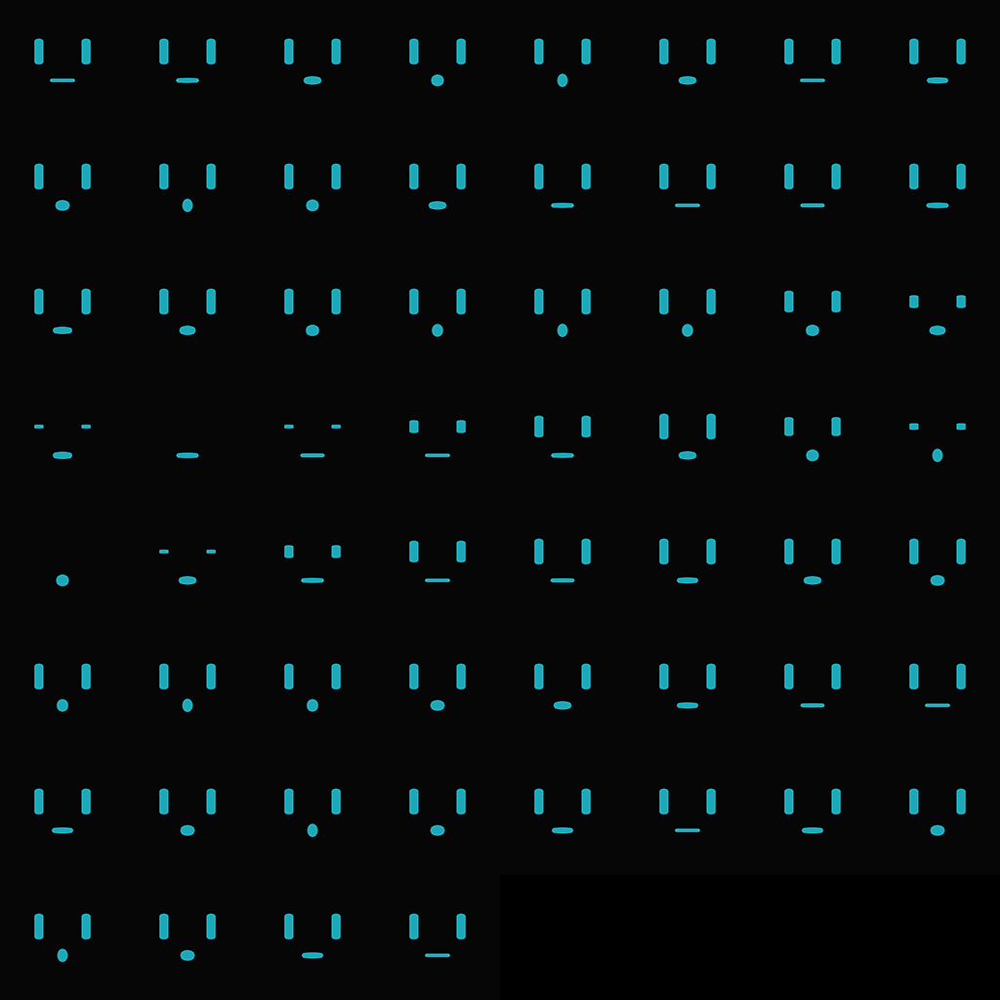

## UV Map

A simple scene that shows a spritesheet animation of a robot talking.



A PlaneShape uses a spritesheet as texture, selecting only a region of the image. The selected region is changed on every frame, to simulate movement.

This is the image used as a spritesheet:



Event though this is not how we animated the robots in Genesis Plaza in the end, it's still a valuable example for other spritesheet implementations.

**Install the CLI**

Download and install the Decentraland CLI by running the following command

```bash
npm i -g decentraland
```

For a more details, follow the steps in the [Installation guide](https://docs.decentraland.org/documentation/installation-guide/).

**Previewing the scene**

Once you've installed the CLI, download this example and navigate to its directory from your terminal or command prompt.

_from the scene directory:_

```
$:  dcl start
```

Any dependencies are installed and then the CLI will open the scene in a new browser tab automatically.

Learn more about how to build your own scenes in our [documentation](https://docs.decentraland.org/) site.

## Copyright info

This scene is protected with a standard Apache 2 licence. See the terms and conditions in the [LICENSE](/LICENSE) file.
